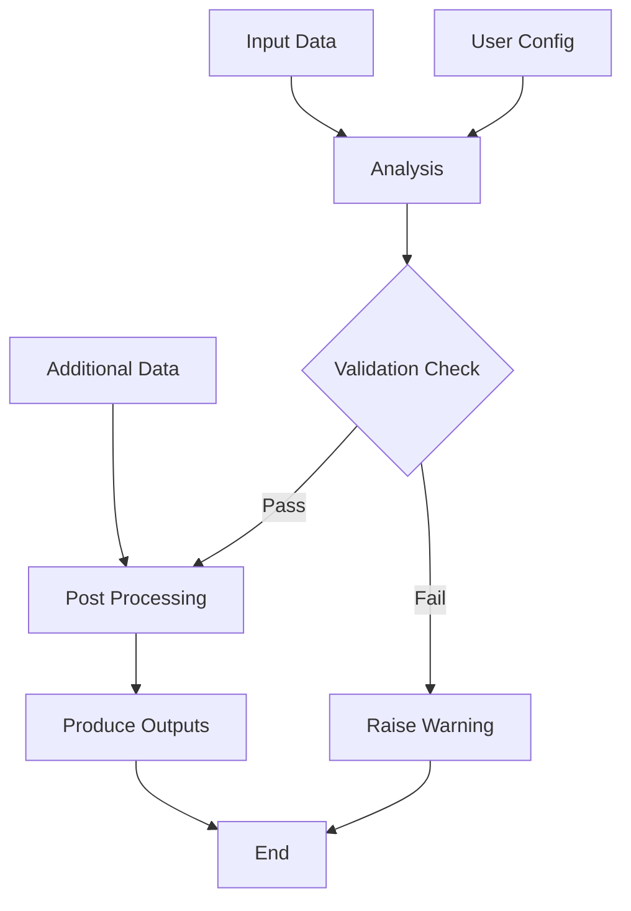

# Project Flow Diagram 

Project flowcharts or diagrams are valuable for illustrating how each module integrates within the main analytical pipeline. Several tools are available for creating these diagrams. For example, [Microsoft Visio][visio] offers a user-friendly interface but may require additional licenses, and diagrams must be uploaded as images to the repository to keep documentation together.

Alternatively, you can use [mermaid], an open-source tool that enables you to create diagrams directly in markdown files. This approach allows for easy updates and version control alongside your codebase. While standard markdown previewers may not render mermaid diagrams without extensions, both [GitHub][github-mermaid] and [GitLab][gitlab-mermaid] support rendering these diagrams online.

For more advanced usage and customization, refer to the [mermaid documentation]. Below is a simple example of how to create a flow diagram for an analytical pipeline using mermaid syntax.

## Example Diagram for Pipeline

Each step in the diagram is represented by a single uppercase letter. 
Connections between steps are shown using arrows (`-->`). 
To add descriptive text to a node, include brackets after the letter (e.g., `A[input data]` for a rectangle, or `D{Validation Check}` for a decision point). 
You can customize node shapes and labels further; see the [mermaid flowchart documentation][mermaid-shapes] for more options.

```code
  flowchart TD;
    A[input data]-->C[analysis];
    B[user config]-->C;
    C-->D{Validation Check};
    D-->|Fail| R[Raise Warning]
    E[additional data]-->F[post processing];
    D-->|Pass|F;
    F-->G[Produce outputs];
    G-->H[End];
    R-->H;
```


## Define nodes first
Alternatively, you can define the shape and label for each node at the start of your diagram. This allows you to reference nodes by their letter only in the flowchart, making the diagram easier to read and maintain.

```code
  flowchart TD;
    A@{label: "Input Data"};
    B@{label: "User Config"};
    C@{label: "Analysis"};
    D@{shape: decision, label: "Validation Check"};
    E@{label: "Additional Data"};
    F@{label: "Post Processing"}
    G@{label: "Produce Outputs"}
    H@{label: "End"}
    R@{label: "Raise Warning"};

    A-->C;
    B-->C;
    C-->D;
    D-->|Fail| R
    E-->F;
    D-->|Pass|F;
    F-->G;
    G-->H;
    R-->H;
```




[visio]: https://www.microsoft.com/en-gb/microsoft-365/visio/flowchart-software
[mermaid]: https://mermaid.js.org/intro/
[mermaid documentation]: https://mermaid.js.org/intro/#diagram-types
[mermaid-shapes]: https://mermaid.js.org/syntax/flowchart.html#node-shapes
[github-mermaid]: https://github.blog/developer-skills/github/include-diagrams-markdown-files-mermaid/
[gitlab-mermaid]: https://docs.gitlab.com/user/markdown/#diagrams-and-flowcharts